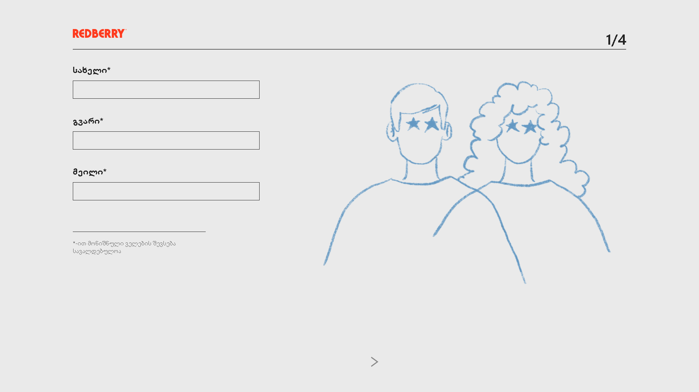

<h1 align="center">Welcome to Redberry-Covid-Form 👋</h1>

  <a href="https://www.npmjs.com/package/github-search" target="_blank">
<!--      -->
  </a>

##  About the project
>  Redberry-Covid-Form is an application that I have built during the Redberry challenge. The app features interactive  form validation.
### ✨ [Demo](https://davitamgl.github.io/redberry-challenge/)
## 
<h1 align="center">
	
</h1>

## Technologies that I used to develop this app

- React

- React Hooks

- Redux

- Sass

- Material-UI

## Author

👤 **Davit Amaghlobeli**

* Github: [@Davitamgl](https://github.com/Davitamgl)
* LinkedIn: [@https:\/\/www.linkedin.com\/in\/davitamaghlobeli\/](https://linkedin.com/in/https:\/\/www.linkedin.com\/in\/davitamaghlobeli\/)

## Show your support

Give a ⭐️ if this project helped you!
